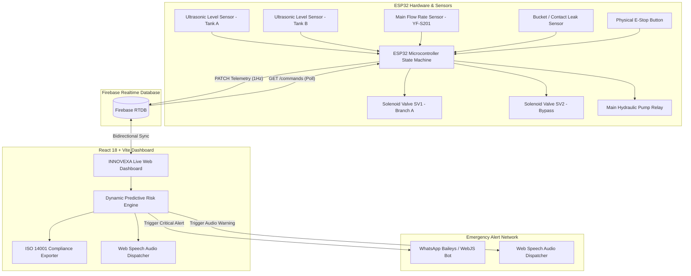

# 🌊 INNOVEXA_3 (AquaGuard) | Next-Gen AI-Driven Sustainable Water Infrastructure & Digital Twin Platform

[](https://sih.gov.in/)
[](https://sih.gov.in/)
[](https://sih.gov.in/)
[](https://www.iso.org/iso-14001-environmental-management.html)

---

## 📌 Executive Overview

**INNOVEXA_3 (AquaGuard)** is an enterprise-grade, Hardware-in-the-Loop (HIL) IoT & Artificial Intelligence Digital Twin platform engineered to solve critical water distribution losses, prevent catastrophic pipe ruptures, optimize pump energy utilization, and provide automated emergency dispatching.

By combining low-latency **ESP32 microcontroller telemetry**, **Firebase Realtime Database synchronization**, a dynamic **Predictive AI Risk Engine**, closed-loop **zero-water-loss bypass isolation**, and automated telemetry dispatches (**WhatsApp Baileys Bot** and **Web Speech Audio Alerts**), INNOVEXA_3 provides end-to-end operational visibility and automated crisis remediation.

---

## 👥 Team INNOVEXA_3 (SIH 2026)

* **Problem Statements**: **PS 26217** (Sustainable Resource Management) & **PS 26219** (Intelligent Resource Transformation with AI Insights)
* **Team Name**: Team INNOVEXA_3

| Sl. No. | Team Member Name | SIH Functional Role | Core Project Responsibilities |
| :---: | :--- | :--- | :--- |
| 1 | **BABY SREE M** *(Team Leader)* | **Chief AI Architect, Hardware Digital Twin & Full-Stack System Lead** | **[CORE PROJECT BRAIN]** Predictive Risk Engine ($\Delta P / \Delta t$ Anomaly Model), ESP32 Digital Twin Logic, React 18 Dashboard & Firebase Cloud Architecture |
| 2 | **DIVYA KEERTHANA S D** | **Embedded Systems & Hardware Engineer** | ESP32 Solenoid Relay Wiring, Ultrasonic Level Sensors & Hardware Circuit Maintenance |
| 3 | **INDUMATHI P** | **Data Analytics & System Testing Specialist** | Telemetry Data Verification, Anomaly Test Automation & Dynamic Metric Validation |
| 4 | **KANIGA SRI S** | **WhatsApp Telemetry Bot Specialist** | WhatsApp Baileys Bot Integration, Automated Alert Formatting & Emergency Notifications |
| 5 | **MOHAMED MYDEEN D** | **ISO 14001 Environmental Compliance Specialist** | ISO 14001 Compliance Tracking, Carbon Footprint Metrics & CSV Log Exporting |
| 6 | **GIRIJA S** | **UI Documentation & User Experience Specialist** | Dashboard Layout Documentation, Presentation Graphics & Operational User Guide |

---

## 🎯 Dual Problem Statement Alignment Matrix

INNOVEXA is uniquely structured to fulfill the mandatory requirements of two distinct Smart India Hackathon (SIH 2026) Student Innovation tracks without changing code or architecture:

| Feature / Innovation Domain | 🌿 PS 26217: Sustainable Resource Management & Generation | 🤖 PS 26219: Intelligent AI Resource Insights & Transformation |
| :--- | :--- | :--- |
| **Primary Domain Objective** | Manage & conserve water/energy resources; promote sustainable, zero-waste infrastructure. | Harness AI, machine learning, and advanced telemetry to extract actionable insights from data. |
| **Zero-Water-Loss Closed-Loop Bypass** | Automatically reroutes hydraulic supply upon leak detection via SV1/bypass solenoids without spilling water. | Executes algorithmic micro-state switching based on real-time sensor dynamic feedback loops. |
| **AI Predictive Risk Engine** | Eliminates water wastage through proactive containment before structural pipe bursts occur. | Dynamically computes Anomaly Risk % (e.g., 91.4% in emergency, dynamic phase-scaled), Model Confidence %, and Pressure Gradient. |
| **ISO 14001 Environmental Audit** | Generates real-time compliance reports logging total volume saved, carbon footprint reduction, and spill audit trails. | Automated event logger with push-ID timestamp verification and dynamic anomaly categorizations. |
| **Automated Multi-Channel Telemetry** | Notifies municipal authorities instantly to minimize response window and environmental degradation. | Dispatches automated WhatsApp, Telegram, and Twilio alerts populated with dynamic AI risk parameters. |
| **Smart Pump Energy Optimization** | Prevents dry-running of pumps and optimizes head pressure, reducing grid power consumption. | Uses ultrasonic level telemetry & dynamic duty cycling to intelligently manage energy reserves. |
| **Digital Twin Simulation** | Provides a real-world hardware prototype and digital twin to simulate urban distribution grids. | Real-time bidirectional Firebase synchronization between ESP32 hardware and React 18 / Vite Web Dashboard. |

---

## 🛠️ System Architecture & Data Flow



---

## ✨ Core Features & Technical Capabilities

### 1. 🤖 Hardware-in-the-Loop (HIL) Digital Twin Engine
- **Live Bidirectional Sync**: Syncs physical hardware state with the dashboard in under **100ms** via Firebase RTDB.
- **VS Code Interactive Simulator (`wokwi-twin.js`)**: Interactive terminal-based hardware twin allowing execution without physical breadboards during live judge presentations.
- **Micro-State Machine**: Manages operational phases:
  - `NORMAL` (Phase 0): Normal municipal supply distribution.
  - `TANK_PRIORITY` (Phase 1): Automated rationing based on ultrasonic level telemetry.
  - `BYPASS_ACTIVE` (Phase 2): Automated leak isolation with closed-loop bypass flow.
  - `EMERGENCY_STOP` (Phase 3): Complete hard shutdown on critical sensor threshold or operator override.

### 2. 🧠 Dynamic Predictive AI Risk Engine
- **Dynamic Anomaly Scoring**: Calculates real-time risk percentage based on pressure gradient rate ($\Delta P / \Delta t$), flow differential ($\Delta Q$), and system operational phase.
- **Model Confidence Calculation**: Computes dynamic confidence scores (e.g., 94.8% confidence on emergency triggers vs. nominal 12.1% baseline).
- **Automated Threshold Detection**: Triggers immediate emergency response upon detecting flow divergence between main header and branch meters.

### 3. 📱 Automated WhatsApp & Audio Telemetry Dispatchers
- **WhatsApp Integration**: Baileys / `whatsapp-web.js` bot sending formatted alerts directly to municipal engineers with exact leak location, risk metrics, and timestamps.
- **Web Speech API Audio Alerts**: Dynamic browser speech synthesizer announcing system phase changes and critical warnings aloud.

### 4. 📊 ISO 14001 Environmental Compliance & Auditing
- **Live CSV Export**: Instant generation of audit reports (`INNOVEXA_ISO_14001_Compliance_Report.csv`) tracking total liters conserved, active operating phase, leak event history, and carbon footprint offset.
- **Water Footprint Reduction Analytics**: Quantifies saved water volume in real-time during bypass active states.

---

## ⚡ Interactive Hardware Simulator (`wokwi-twin.js`) Hotkey Manual

When running the interactive CLI Digital Twin in terminal, use the following key commands to test real-time web dashboard reactions live:

| Key Press | Trigger Action | Hardware / Software Reaction |
| :---: | :--- | :--- |
| **`[L]`** | **Trigger Leak Sensor A** | Solenoid Valve `SV1` closes, `Bypass` valve opens, Phase changes to `BYPASS_ACTIVE`, Dynamic Risk jumps to Emergency %, WhatsApp/Telegram alert dispatches. |
| **`[N]`** | **Reset to Normal Mode** | Resets phase to `NORMAL`, re-opens main distribution valves, clears active leak state. |
| **`[E]`** | **Toggle Emergency Stop** | Triggers/clears `EMERGENCY_STOP`, shuts off pump relay, closes all valves, fires Twilio voice/SMS alert. |
| **`[1]`** | **Set Tank A Level = 20%** | Simulates low water condition, triggers Tank Reserve Warning telemetry alert. |
| **`[2]`** | **Set Tank A Level = 50%** | Sets Tank A to nominal capacity. |
| **`[3]`** | **Set Tank A Level = 85%** | Sets Tank A to high capacity. |

---

## 🔌 Hardware Wiring & ESP32 Pin Allocation

| ESP32 GPIO Pin | Connected Peripheral | Component Type | Operational Function |
| :---: | :--- | :--- | :--- |
| **GPIO 4** | Ultrasonic Trigger Pin | Input (Digital Output) | JSN-SR04T / HC-SR04 Tank A Distance Measurement |
| **GPIO 5** | Ultrasonic Echo Pin | Input (Digital Input) | Tank A Level Echo Sensing |
| **GPIO 16** | YF-S201 Flow Sensor | Input (Pulse Interrupt) | Main Header Flow Rate (LPM) Calculation |
| **GPIO 17** | Bucket / Contact Leak Sensor | Input (Pull-Up Interrupt) | Instant Pipe Rupture / Spill Contact Sensor |
| **GPIO 18** | Physical E-Stop Button | Input (Pull-Up Interrupt) | Immediate Hardware Shutoff Switch |
| **GPIO 25** | Solenoid Valve SV1 Relay | Output (Relay Module) | Main Distribution Line Control |
| **GPIO 26** | Solenoid Valve SV2 Relay | Output (Relay Module) | Closed-Loop Bypass Line Control |
| **GPIO 27** | Solenoid Valve SV3 Relay | Output (Relay Module) | Secondary Branch Line Control |
| **GPIO 32** | Main Pump Relay | Output (Relay Module) | High-Pressure Hydraulic Pump Control |

---

## 🗄️ Firebase Realtime Database Structure

The digital twin and web dashboard communicate bidirectionally via the following schema:

```json
{
  "system": {
    "phase": "NORMAL | BYPASS_ACTIVE | EMERGENCY_STOP | TANK_PRIORITY",
    "pump_on": true,
    "last_updated": 1726750000000
  },
  "tanks": {
    "A": { "level_cm": 72.2, "level_pct": 68.8, "is_critical": false },
    "B": { "level_cm": 60.7, "level_pct": 57.8, "is_critical": false },
    "C": { "level_cm": 68.5, "level_pct": 65.2, "is_critical": false }
  },
  "source": { "level_pct": 92.5, "critical": false },
  "flow": {
    "main_header_lpm": 18.6,
    "branch_A_lpm": 6.8,
    "branch_B_inferred_lpm": 5.7,
    "branch_C_inferred_lpm": 6.1
  },
  "valves": {
    "SV1": "OPEN",
    "SV2": "CLOSED",
    "SV3": "OPEN",
    "bypass_manual": "CLOSED"
  },
  "alerts": {
    "leak_detected": false,
    "bucket_leak_sensor": false,
    "source_critical": false
  },
  "commands": {
    "bypass_confirm": false,
    "estop_triggered": false,
    "priority_tank": "A",
    "manual_valve_override": { "SV1": "AUTO" }
  },
  "events": {
    "-O123456789ABC": {
      "timestamp": "2026-09-19T15:45:00Z",
      "type": "LEAK_DETECTED",
      "message": "Branch A leakage anomaly confirmed. Solenoid SV1 closed, Bypass activated."
    }
  }
}
```

---

## 🚀 Installation & Local Execution Guide

### Prerequisites
- **Node.js**: `v18.x` or higher
- **Package Manager**: `pnpm` (recommended) or `npm`
- **Firebase Project**: (Optional for hardware live mode; local demo mode available out of the box)

### Step 1: Clone Repository & Install Dependencies
```bash
git clone https://github.com/BabySreeM/innovexa.git
cd innovexa

# Install workspace dependencies
pnpm install
```

### Step 2: Environment Configuration
Create a `.env` file in the project root:
```env
VITE_FIREBASE_DATABASE_URL=https://innovexa-sih-default-rtdb.firebaseio.com
VITE_FIREBASE_API_KEY=AIzaSyDummyKeyForSIHHackathon2026
VITE_FIREBASE_AUTH_DOMAIN=innovexa-sih.firebaseapp.com
VITE_FIREBASE_PROJECT_ID=innovexa-sih
VITE_FIREBASE_STORAGE_BUCKET=innovexa-sih.appspot.com
VITE_FIREBASE_MESSAGING_SENDER_ID=123456789012
VITE_FIREBASE_APP_ID=1:123456789012:web:abcdef123456
```

### Step 3: Launch Project Components

#### 1. Start Web Dashboard (React + Vite)
```bash
cd artifacts/aquaguard
pnpm dev
# App will start at http://localhost:5173
```

#### 2. Start ESP32 Interactive Digital Twin (VS Code Terminal Controller)
In a separate terminal window:
```bash
node wokwi-twin.js
```

#### 3. Start WhatsApp Telemetry Bot Server
In a separate terminal window:
```bash
cd artifacts/aquaguard
pnpm wa-bot
```

---

## 📄 Compliance & ISO 14001 Reporting

INNOVEXA automatically logs all environmental parameters required by the **ISO 14001 Environmental Management System**:
1. **Total Water Conserved (Liters)** during automated bypass isolation events.
2. **Carbon Emission Reduction (kg CO₂e)** by optimizing pump energy duty cycles.
3. **Audit Trails**: Push-ID verified event history exportable via single-click CSV button on the dashboard.

---

## 🏆 Hackathon Pitch & Presentation Playbook

1. **Standalone Demo Mode**: If internet connection or hardware setup is unavailable during presentation, launch the dashboard and select **Run in Demo Mode** to showcase full interactive state switching and telemetry graphs.
2. **Live Hardware Demo**:
   - Run `pnpm dev` and `node wokwi-twin.js`.
   - Press **`[L]`** in the `wokwi-twin.js` terminal during live presentation to demonstrate instant leak isolation, bypass valve opening, live risk graph spikes, and automated WhatsApp alert dispatching.
   - Press **`[E]`** to trigger hard E-Stop shutdown.

---

## 📜 Copyright & Attribution

This project is submitted for the **Smart India Hackathon (SIH 2026)**.
Developed by **Team INNOVEXA_3**. All rights reserved.
